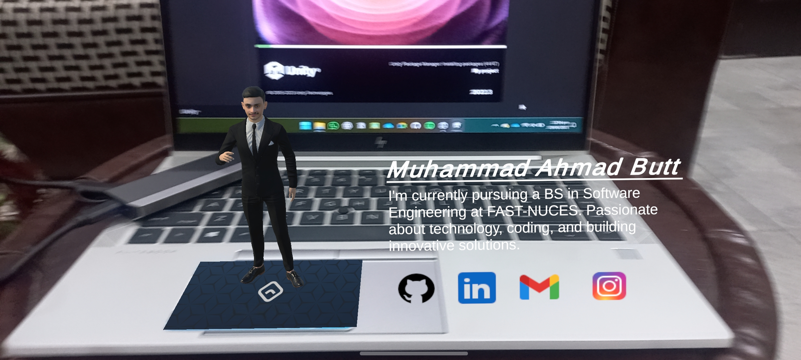

# CardAR
**An Augmented Reality portfolio application for Android devices**

### Demo

*Main interface with card scanning functionality*

## Overview
**CardAR** is a card-based augmented reality application that brings physical cards to life through AR technology. By scanning specially designed cards with your Android device, users can experience interactive 3D content, animations, and immersive AR experiences. Built with Unity and AR Foundation, this application demonstrates the power of marker-based AR tracking.

This project leverages Unity's AR Foundation framework to provide cross-platform AR capabilities, with optimized performance for Android devices running ARCore.

## Features
### Core Functionality
- **Card Recognition** - Advanced image tracking to recognize and track physical cards
- **3D Content Display** - Render 3D models and animations anchored to card positions
- **Real-time Tracking** - Smooth and stable AR tracking with minimal jitter
- **Interactive Elements** - Touch interactions with AR content

## Technical Specifications
| Component | Details |
|-----------|---------|
| **Engine** | Unity 2022.3 LTS |
| **AR Framework** | AR Foundation with ARCore |
| **Target Platform** | Android |
| **Minimum Android Version** | Android 8.0 (API Level 26) |
| **Scripting Backend** | IL2CPP |
| **API Compatibility Level** | .NET Standard 2.1 |
| **Target Architecture** | ARM64 |
| **Company** | Eggy Studio |
| **Package ID** | com.EggyStudio.CardAR |

## Prerequisites
### Software Requirements
- **Unity Hub** (Latest version)
- **Unity 2022.3 LTS** (Recommended version)
- **Android Build Support** module for Unity
- **Android SDK** and **NDK**
- **JDK** (Java Development Kit)
- **Git** (for version control)

## Installation
### 1. Clone the Repository
```bash
git clone https://github.com/m-ahmad-butt/Augmented-Reality-Portfolio.git
cd "Augmented-Reality-Portfolio
```

### 2. Open in Unity
1. Launch **Unity Hub**
2. Click **"Open"** or **"Add"**
3. Navigate to the cloned project folder
4. Ensure Unity **2022.3 LTS** is installed
5. Unity will import all assets (this may take several minutes)

### 3. Configure Build Settings
1. Go to **File → Build Settings**
2. Select **Android** platform
3. Click **"Switch Platform"** if not already selected
4. Under **Texture Compression**, select **ASTC**
5. Click **"Player Settings"** and configure:
   - **Company Name:** Eggy Studio
   - **Product Name:** CardAR
   - **Package Name:** com.EggyStudio.CardAR
   - **Minimum API Level:** Android 8.0 (API Level 26)

### 4. Enable Developer Mode on Android Device
1. Go to **Settings → About Phone**
2. Tap **Build Number** 7 times to enable Developer Options
3. Go to **Settings → Developer Options**
4. Enable **USB Debugging**
5. Connect device via USB cable

### 5. Build and Deploy
#### Option A: Build and Run (Recommended)
1. In Unity, go to **File → Build Settings**
2. Ensure your Android device is connected and recognized
3. Click **"Build and Run"**
4. Choose a location to save the APK
5. Unity will build and automatically install on your device

#### Option B: Build APK Only
1. Click **"Build"** instead of "Build and Run"
2. Save the APK file
3. Transfer to your Android device and install manually

## Usage
### Getting Started
1. **Launch the Application** on your Android device
2. **Grant Camera Permissions** when prompted
3. **Point your camera** at a CardAR marker card
4. **Watch** as 3D content appears anchored to the card
5. **Interact** with the AR content by touching the screen

## Contributing
Contributions are welcome! Please follow these guidelines:
1. **Fork** the repository
2. Create a **feature branch** (`git checkout -b feature/AmazingFeature`)
3. **Commit** your changes (`git commit -m 'Add some AmazingFeature'`)
4. **Push** to the branch (`git push origin feature/AmazingFeature`)
5. Open a **Pull Request**

### Development Guidelines
- Follow Unity C# coding conventions
- Test all changes on actual Android hardware
- Document new features and changes
- Ensure backward compatibility when possible

## License
This project is for educational purposes.
